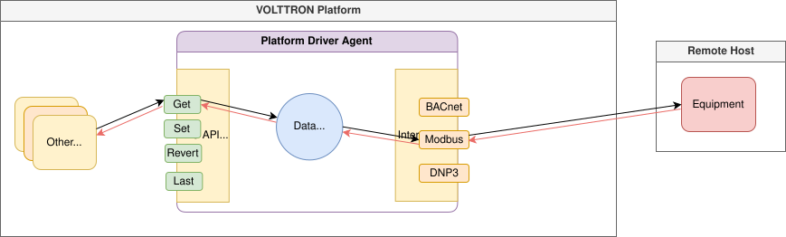
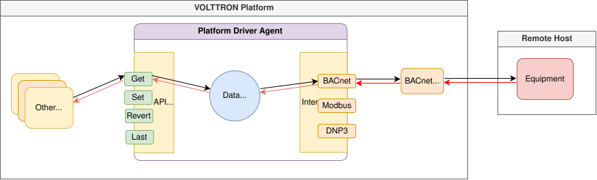

.. _Driver-Framework:

=========================
Platform Driver Framework
=========================

VOLTTRON drivers act as an interface between agents on the platform and a device. Drivers implement a specific set
of features for device communication and ensure uniform behaviors across different devices and protocols.

Drivers are managed by the :ref:`Platform Driver Agent <Platform-Driver-Agent>`. The Platform Driver
instantiates individual drivers and facilitates communication with them. Driver instances are created when a new device
configuration is added to the configuration store. Each driver instance uses an Interface class that implements the
communication paradigms of a specific device or protocol. For more information regarding the development of driver
interfaces, see :ref:`the driver development page <Driver-Development>`.

.. _Driver_Communication:

Device Communication
====================

Data Trending
-------------

The most common use case for the Platform Driver Agent is to trend equipment data on a periodic schedule.
On startup, or once it has received a new device configuration, the Platform Driver builds a polling schedule which it
will use to query actively trended data points from the device. The poll rate at which the points are trended is
configurable on both a per-device and per-point basis. Trending for any configured point may additionally be started
and stopped transiently while the driver is running or permanently in configuration. For a more complete
description of the configuration options and RPC methods which can be used to manage data trending, see
:ref:`Polling Configuration <Polling-Configuration>`

Whenever trended points are polled, these are then published to the message bus. There are several options available
for how these publishes are organized. Points can be published at the time they are polled (individually or in batches).
Alternately, they can be published a fixed schedule for entire devices (which may include points polled at
different rates). See :ref:`Trending Publish Configurations <Trending-Publish-Configurations>` for detailed
information on how trending publishes can be configured. The default (and generally recommended) behavior is to publish
all simultaneously polled points in a batch on the ``devices/<device_topic>/multi`` topic.
The ``/multi`` postfix is used by historians to identify device publishes which should be archived to the database since
these will contain multiple points but are still guaranteed to be the result of fresh queries.

..
    TODO:: This discussion of topics should probably be moved to a dedicated section describing the Equipment Tree.

The ``<device_topic>`` associated with a given device is arbitrary and configurable by the user. A common convention,
however, is to use a hierarchical naming convention to indicate where the associated equipment might be found:

    ``<campus>/<building>/<device>/<sub_device>``

.. warning::

    It should be noted that the default ``/multi`` behavior is different from older (<=10.0) versions of VOLTTRON, which
    usually published to an ``/all`` postfixed topic when a device was polled. The rationale for this change is that
    since VOLTTRON previously allowed only a single poll rate per device, it was guaranteed that all points on the
    device would be queried on every poll. Allowing different poll rates for each point breaks
    this conceit. New agents, written for the ``/multi`` paradigm should assume that different points may arrive at
    different times. For use with existing agents, which often expect all points to arrive with every incoming publish,
    it is possible to emulate the old behavior. An ``/all`` type publish can be configured to run on a given interval,
    separate from the poll rate for any point on the device. The last known value is provided for every actively
    trended point each time the ``/all`` publish is made. It is left to users of ``/all`` publishes to ensure that
    trended points are being polled with sufficient frequency to avoid the publication of stale data in this paradigm.

Query & Command Methods
-----------------------

In addition to continuous polling, point values can be requested or set ad-hoc via :ref:`RPC methods exposed by the
Platform Driver Agent <Platform-Driver-RPC>`.  RPC methods are available for getting, setting, and reverting data points
as well as for the management of reservations and polling.

* To get, set, or release the current values of one or more points, the user agent should send an RPC call to the
  ``get``, ``set``, or ``revert`` methods, respectively, of the Platform Driver. Queries can be made by providing one or
  more topics. Any segment of these topics may be replaced with wildcards. Results may additionally be filtered using
  regular expressions. After the Platform Driver processes the request, the data is returned directly to the requestor.

* Last known values may be retrieved without making a new request to the equipment using the ``last`` method.

* If there is a possibility of conflicting commands being given to devices, it is recommended to first reserve
  the device. Reservations allow a single agent exclusive control of the device for the duration of a scheduled period.
  During that time, only the reserving agent may send requests which would alter the value of points. Agents
  without a reservation, however, will continue to have read access to the device throughout the reservation period.
  Reservations are managed with the ``request_new_schedule`` and ``request_cancel_schedule`` methods.

Typical Data Flow
-----------------

The below diagram demonstrates driver communication on the platform in a typical case.

1. Platform agents and agents developed and/or installed by users communicate with the platform via pub/sub or JSON-RPC.
   Agents share data for a number of reasons including querying historians for data to use in control algorithms,
   fetching data from remote web APIs and monitoring.
2. A user agent which wants to request data ad-hoc sends a JSON-RPC request to the Platform Driver to `get_point`,
    asking the driver to fetch the most up-to-date point data for the topic provided.

    .. note::

       For periodic `scrape_all` data publishes, step 2 is not required.  The Platform Driver is configured to
       automatically collect all point data for a device on a regular interval and publish the data to the bus.

3. A user agent sends a request to the actuator to establish a schedule for sending device control signals, and during
   the scheduled time sends a `set_point` request to the Actuator.  Given that the control signal arrives during the
   scheduled period, the Actuator forwards the request to the Platform Driver.  If the control signal arrives outside
    the scheduled period or without an existing schedule, a LockError exception will be thrown.
4. The Platform Driver issues a `get_point`/`set_point` call to the Driver corresponding to the request it was sent.
5. The device driver uses the interface class it is configured for to send a data request or control signal to the
   device (i.e. the BACnet driver issues a `readProperty` request to the device).
6. The device returns a response indicating the current state.
7. The the response is forwarded to the requesting device.  In the case of a `scrape_all`, the device data is published
   to the message bus.

Special Case Drivers
--------------------

Some drivers require a different communication paradigm. One common alternative is shown in the diagram below:

.. image:: files/proxy_driver_flow.png

This example describes an alternative pattern wherein BACnet drivers communicate via a BACnet proxy agent to communicate
with end devices. This behavior is derived from the networking requirements of the BACnet specification. BACnet
communication in the network layer requires that only one path exist between BACnet devices on a network.
In this case, the BACnet Proxy Agent acts as a virtual BACnet device, and device drivers forward their requests to this
agent which then implements the BACnet communication (whereas the typical pattern would have devices communicate
directly with the device). There are many other situations which may require this paradigm to be adopted (such as
working with remote APIs with request limits), and it is up to the party implementing the driver to determine if this
pattern or another pattern may be the most appropriate implementation pattern for their respective use case.

.. note::

   Other requirements for driver communication patterns may exist, but on an individual basis.  Please refer to the
   documentation for the driver of interest for more about any atypical pattern that must be adhered to.

Installing the Fake Driver
**************************

The Fake Driver is included as a way to quickly see data published to the message bus in a format that mimics what a
real driver would produce.  This is a simple implementation of the VOLTTRON driver framework.

See :ref:`instructions for installing the fake driver <Fake-Driver-Install>`

To view data being published from the fake driver on the message bus, one can
:ref:`install the Listener Agent <Listener-Agent>` and read the VOLTTRON log file:

.. code-block:: bash

    cd <root volttron directory>
    tail -f volttron.log

.. toctree::
   :hidden:

   Platform Driver <platform-driver-agent>
   Actuator <external-docs/volttron-actuator/docs/source/index>
   Fake <external-docs/volttron-lib-fake-driver/docs/source/index>
   BACnet <external-docs/volttron-lib-bacnet-driver/docs/source/index>
   DNP3 <external-docs/volttron-lib-dnp3-driver/docs/source/index>
   Modbus <external-docs/volttron-lib-modbus-driver/docs/source/index>
   ModbusTk <external-docs/volttron-lib-modbustk-driver/docs/source/index>
